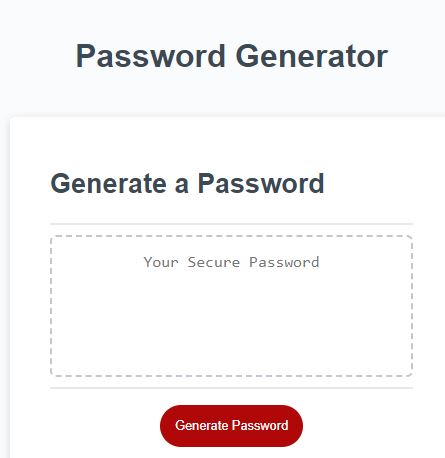

# Password Generator

## Description

This project modify starter code to create an application that enables employees to generate random passwords based on criteria that they’ve selected.
The password length must be a number between 8-128 characters. User may choose to include uppercase, lowercase, special characters and numbers.
In this project I use the following windows method:
- prompt to receive user input.
- alert to notify the user of the correct password criteria
- confirm to get user's character selection to include in the password.

## Table of Contents 

If your README is long, add a table of contents to make it easy for users to find what they need.

- [Usage](#usage)
- [Credits](#credits)

## Usage
To use this application:
- Copy the live link to your browser.
- Click the red button "Generate Password".
- Answer window prompt with the length of the password and click "ok".
- Choose which password criteria would you like to include in your password by clicking "ok" for yes or "cancel" for no.
- If not chacters are selected, application display "No Character has been selected, please try again".

    
   - 

   - 

   - 
    

## Credits

Tutorials used:
- [W3School confirm method](https://www.w3schools.com/jsref/met_win_confirm.asp)
- [W3School prompt method](https://www.w3schools.com/jsref/tryit.asp?filename=tryjsref_prompt)
- [W3School alert method](https://www.w3schools.com/jsref/met_win_alert.asp)
- [W3School how to generate a random character](https://www.w3schools.com/js/js_random.asp)

